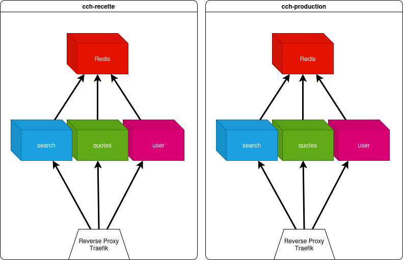
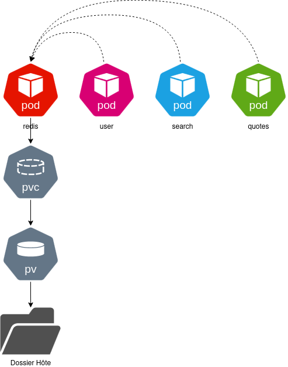

# Dossier d'Architecture Technique - DAT

**Projet :** SAE 5.03 - Orchestration de l’application "Captain Haddock"  
**Date :** 19 Janvier 2026  
**Version :** 1.0

---

## 1. Contexte et Objectifs

Ce document définit l'architecture technique pour le déploiement de l'application de citations du capitaine Haddock. L'objectif est de passer d'une architecture monolithique à une architecture "cloud native" conteneurisée et orchestrée.

Le déploiement vise à mettre en place deux environnements distincts (de Recette et de Production) sur une infrastructure unique, tout en garantissant leur cloisonnement et la persistance des données pour chacune.

## 2. Architecture Applicative

Conformément à la demande du Lot 3, l'application sera découpée en 3 microservices autonomes.

| Service | Fonctionnalité                     | Point d'accès API |
|:--------|:-----------------------------------|:------------------|
| **Users**   | Gestion des utilisateurs           | `/users`            |
| **Quotes**  | Gestion des citations              | `/quotes`           |
| **Search**  | Recherche de citations par mot-clé | `/search`           |
| **Redis**   | Base de données                    |                   |

*Chaque service sera encapsulé dans son propre conteneur Docker ainsi réplicable.*

## 3. Infrastructure et Orchestration

L'orchestration sera réalisé par Kubernetes K3S sur une machine virtuelle unique simulant un cluster.

Pour respecter l'exigence d'isolation, nous utiliserons des namespaces distincts :

* `cch-recette` : Pour les tests et la qualification de l’application.
* `cch-production` : Pour l'application finale en production.

L’utilisation des namespaces permet de déployer de manière isolé un ensemble de composant Kubernetes. Ceux-ci ne peuvent pas avoir d’interaction direct entre eux, mais porter les mêmes nom par exemple.

Les bases de données nécessitent une persistance, nous utiliserons des PersistentVolumeClaims liés à du stockage local (via un HostPath) pour assurer que les données survivent au redémarrage des pods et au travers de la vie de l’application.

Ainsi, les données seront conservé dans un répertoire physique de l’hôte. Ce mécanisme permettra de donner accès aux données à plusieurs pods en simultané également dans un contexte de scalabilité horizontale.

## 4. Gestion des Flux et Réseau

L'accès à l'application au travers d’un environnement namespace est centralisé via un Reverse Proxy unifié.

Nous utiliserons Traefik pour gérer les routes HTTP entrantes vers les différents services.

Les noms de domaine seront gérés via le service nip.io pour rediriger vers l'IP de la VM.

* Format : `[service].[environnement].[ip].nip.io`

Un Middleware Traefik sera configuré pour limiter le nombre de requêtes à 10 par minute, assurant ainsi une protection contre la surcharge.