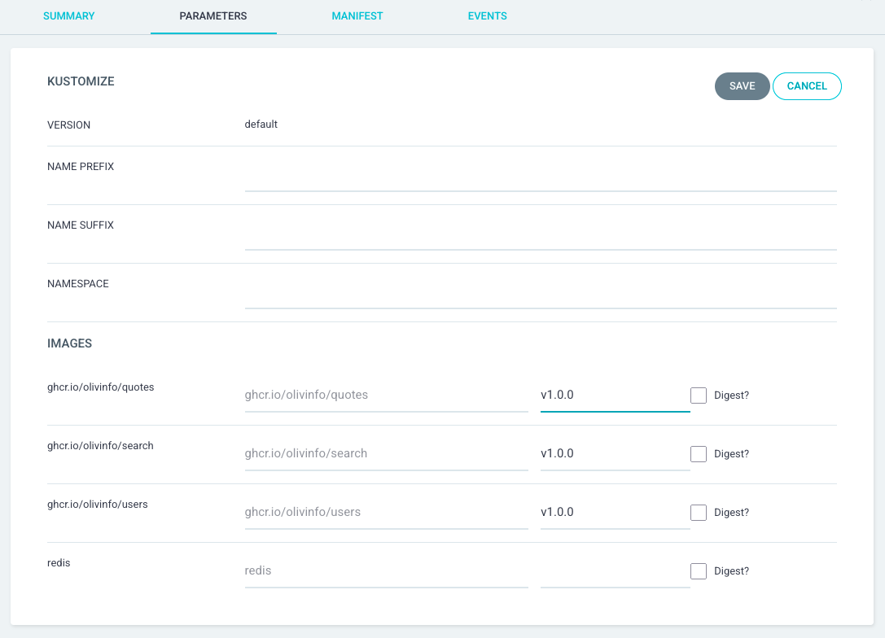

# Cahier d'Installation Technique (CIT)

**Projet :** SAE 5.03 - Orchestration de l'application "Citations du Capitaine Haddock"  
**Date :** 31 Janvier 2026  
**Version :** 1.0

---

## 1. Architecture Matérielle

### 1.1 Caractéristiques de la Machine Virtuelle

| Composant | Spécification |
|-----------|---------------|
| **Système d'exploitation** | Debian GNU/Linux 13 |
| **RAM** | 6 Go |
| **Stockage** | 38 Go |
| **Interface réseau** | 1 |

### 1.2 Adressage Réseau

| Élément | Valeur |
|---------|--------|
| **IP principale** | `172.18.253.218/16` |
| **Passerelle** | `172.18.255.254` |

### 1.3 Résolution DNS

Contenu du fichier /etc/resolv.conf
```
nameserver 8.8.8.8
nameserver 172.19.11.252
search rt.lan
```

---

## 2. Architecture Logicielle

### 2.1 Composants Installés

| Composant | Version | Rôle |
|-----------|---------|------|
| **K3s** | v1.34.3+k3s1 | Orchestrateur Kubernetes léger |
| **Traefik** | v3.5.1 | Ingress Controller / Reverse Proxy |
| **ArgoCD** | - | GitOps - Déploiement continu |
| **Trivy Operator (via ArgoCD)** | - | Audit de sécurité  |

### 2.2 Schéma d'Architecture

```
┌─────────────────────────────────────────────────────────────────────────────┐
│                        VM Debian 13 (172.18.253.218)                        │
│                                                                             │
│  ┌───────────────────────────────────────────────────────────────────────┐  │
│  │                           K3s Cluster                                 │  │
│  │                                                                       │  │
│  │   ┌─────────────┐     ┌──────────────────────────────────────────┐    │  │
│  │   │   Traefik   │     │           Namespace: cch-production      │    │  │
│  │   │  (Ingress)  │────▶│  ┌───────┐ ┌───────┐ ┌───────┐ ┌─────┐   │    │  │
│  │   │  Port 80    │     │  │ Users │ │Quotes │ │Search │ │Redis│   │    │  │
│  │   └─────────────┘     │  └───────┘ └───────┘ └───────┘ └─────┘   │    │  │
│  │          │            └──────────────────────────────────────────┘    │  │
│  │          │                                                            │  │
│  │          │            ┌──────────────────────────────────────────┐    │  │
│  │          │            │           Namespace: cch-recette         │    │  │
│  │          └───────────▶│  ┌───────┐ ┌───────┐ ┌───────┐ ┌─────┐   │    │  │
│  │                       │  │ Users │ │Quotes │ │Search │ │Redis│   │    │  │
│  │                       │  └───────┘ └───────┘ └───────┘ └─────┘   │    │  │
│  │                       └──────────────────────────────────────────┘    │  │
│  │                                                                       │  │
│  │   ┌─────────────┐     ┌──────────────┐                                │  │
│  │   │   ArgoCD    │     │Trivy Operator│                                │  │
│  │   │ (namespace) │     │  (security)  │                                │  │
│  │   └─────────────┘     └──────────────┘                                │  │
│  └───────────────────────────────────────────────────────────────────────┘  │
└─────────────────────────────────────────────────────────────────────────────┘
```

---

## 3. URLs d'Accès (via nip.io)

| Environnement | Service | URL |
|---------------|---------|-----|
| **Production** | Users | `http://users.172.18.253.218.nip.io` |
| **Production** | Quotes | `http://quotes.172.18.253.218.nip.io` |
| **Production** | Search | `http://search.172.18.253.218.nip.io` |
| **Recette** | Users | `http://users-rec.172.18.253.218.nip.io` |
| **Recette** | Quotes | `http://quotes-rec.172.18.253.218.nip.io` |
| **Recette** | Search | `http://search-rec.172.18.253.218.nip.io` |

---

## 4. Procédure d'Installation

### 4.1 Prérequis

- Accès root à la machine
- Connexion Internet active et configuration complète (IP, DNS, Passerelle)
- Avoir installé `git` (pour une installation sans ArgoCD)

### 4.2 Installation de K3s

```bash
# Installation de K3s (incluent Traefik par défaut)
curl -sfL https://get.k3s.io | sh -

# Vérification de l'installation
k3s --version
# Retourne : k3s version v1.34.3+k3s1
```

### 4.3 Création des Namespaces

```bash
# Création des namespaces pour les environnements (Pas nécéssaire avec l'utilisation d'ArgoCD, celui-ci peut être configuré pour automatiquement les créer)
kubectl create namespace cch-production
kubectl create namespace cch-recette
```

### 4.4 Création des Secrets

#### Secret pour le Registry GitHub (ghcr.io)

```bash
# Créer le secret pour pull les images depuis ghcr.io
# Il faut préalablement récupérer un PAT (Private Access Token) sur GitHub avec la permission 'read:packages' activée (https://github.com/settings/tokens)
# Remplacer <GITHUB_USERNAME> et <GITHUB_PAT> par vos valeurs

kubectl create secret docker-registry ghcr-secret \
  --docker-server=ghcr.io \
  --docker-username=<GITHUB_USERNAME> \
  --docker-password=<GITHUB_PAT> \
  -n cch-production

kubectl create secret docker-registry ghcr-secret \
  --docker-server=ghcr.io \
  --docker-username=<GITHUB_USERNAME> \
  --docker-password=<GITHUB_PAT> \
  -n cch-recette
```

#### Secrets pour l'authentification API (ADMIN_KEY)

```bash
# Production
kubectl create secret generic users-secrets --from-literal=ADMIN_KEY=<VOTRE_CLE_ADMIN> -n cch-production
kubectl create secret generic quotes-secrets --from-literal=ADMIN_KEY=<VOTRE_CLE_ADMIN> -n cch-production
kubectl create secret generic search-secrets --from-literal=ADMIN_KEY=<VOTRE_CLE_ADMIN> -n cch-production

# Recette
kubectl create secret generic users-secrets --from-literal=ADMIN_KEY=<VOTRE_CLE_ADMIN> -n cch-recette
kubectl create secret generic quotes-secrets --from-literal=ADMIN_KEY=<VOTRE_CLE_ADMIN> -n cch-recette
kubectl create secret generic search-secrets --from-literal=ADMIN_KEY=<VOTRE_CLE_ADMIN> -n cch-recette
```

### 4.5 Déploiement avec Kustomize

```bash
# Cloner la repository
git clone https://github.com/olivinfo/sae503-th-kd.git
cd sae503-th-kd

# Déployer l'environnement de recette
kubectl apply -k kubernetes/overlays/recette/

# Déployer l'environnement de production
kubectl apply -k kubernetes/overlays/production/
```

### 4.6 Déploiement avec ArgoCD (Optionnel)

ArgoCD permet un déploiement GitOps : les modifications du dépôt Git sont automatiquement synchronisées avec le cluster.

#### Installation d'ArgoCD

```bash
# Créer le namespace ArgoCD
kubectl create namespace argocd

# Installer ArgoCD depuis le manifeste officiel
kubectl apply -n argocd -f https://raw.githubusercontent.com/argoproj/argo-cd/stable/manifests/install.yaml

# Attendre un peu
```

#### Accès à l'Interface Web

```bash
# Exposer via un NodePort (accès permanent en Web)
kubectl patch svc argocd-server -n argocd -p '{"spec": {"type": "NodePort"}}'

# Récupérer le port attribué
kubectl get svc argocd-server -n argocd
# Exemple : 80:32612/TCP → accès via http://172.18.253.218:32612
```

#### Récupération du Mot de Passe Admin

```bash
# Le mot de passe initial est stocké dans un secret
kubectl -n argocd get secret argocd-initial-admin-secret -o jsonpath="{.data.password}" | base64 -d
```

- **Utilisateur** : `admin`
- **Mot de passe** : (résultat de la commande précédente)

#### Création des Applications CCH dans ArgoCD

Une fois dans l'interface web d'ArgoCD, faite "+ NEW APP", puis dans "EDIT AS YAML", vous pouvez saisir l'un des manifest suivant :

```yaml
# Application Recette
apiVersion: argoproj.io/v1alpha1
kind: Application
metadata:
  name: captain-hook-recette
  namespace: argocd
spec:
  project: default
  source:
    repoURL: https://github.com/olivinfo/sae503-th-kd.git
    targetRevision: develop
    path: kubernetes/overlays/recette
  destination:
    server: https://kubernetes.default.svc
    namespace: cch-recette
  syncPolicy:
    automated:
      prune: true
      selfHeal: true
    syncOptions:
      - CreateNamespace=true
---
# Application Production
apiVersion: argoproj.io/v1alpha1
kind: Application
metadata:
  name: captain-hook-production
  namespace: argocd
spec:
  project: default
  source:
    repoURL: https://github.com/olivinfo/sae503-th-kd.git
    targetRevision: HEAD
    path: kubernetes/overlays/production
  destination:
    server: https://kubernetes.default.svc
    namespace: cch-production
  syncPolicy:
    automated:
      prune: true
      selfHeal: true
    syncOptions:
      - CreateNamespace=true
```

#### Spécifier une Version d'Image Précise (Optionnel)

Par défaut, ArgoCD déploie la dernière version des images disponibles sur la branche ciblée (`develop` ou `main`/`HEAD`). Pour figer une version spécifique (ex: `v1.0.0`), vous pouvez surcharger les tags d'images via la section `kustomize.images` :

```yaml
apiVersion: argoproj.io/v1alpha1
kind: Application
metadata:
  name: captain-hook-production
  namespace: argocd
spec:
  project: default
  source:
    repoURL: https://github.com/olivinfo/sae503-th-kd.git
    targetRevision: HEAD
    path: kubernetes/overlays/production
    kustomize:
      images:
        - ghcr.io/olivinfo/quotes:v1.0.0
        - ghcr.io/olivinfo/search:v1.0.0
        - ghcr.io/olivinfo/users:v1.0.0
  destination:
    server: https://kubernetes.default.svc
    namespace: cch-production
  syncPolicy:
    automated:
      prune: true
      selfHeal: true
    syncOptions:
      - CreateNamespace=true
```

Ou une fois le manifest appliqué, dans "DETAILS", puis "PARAMETERS", en édiant les images pour y préciser le tag utilisé :



Cette approche permet de :
- **Contrôler les versions déployées** en production (tags SemVer : `v1.0.0`, `v1.2.3`, etc.)
- **Rollback facilement** en modifiant simplement le tag de l'image

> [!NOTE]
> Les tags disponibles sont générés automatiquement par le workflow GitHub Actions lors des merges sur `main` (voir [SECURITY.md](../../SECURITY.md) - section 3).

---

## 5. Vérifications Post-Installation

### 5.1 Vérifier les Pods

```bash
# Environnement Recette
kubectl get pods -n cch-recette -o wide

# Résultat type :
# NAME                      READY   STATUS    RESTARTS   AGE
# quotes-55c888697-nwmgj    1/1     Running   0          XXm
# redis-6c547c4494-gnqt4    1/1     Running   0          XXm
# search-5689cf4774-fppst   1/1     Running   0          XXm
# users-7dbb6d8c6b-9hdmf    1/1     Running   0          XXm

# Idem pour l'environnement Production
kubectl get pods -n cch-production -o wide
```

### 5.2 Vérifier les Services

```bash
kubectl get svc -n cch-recette
kubectl get svc -n cch-production
```

### 5.3 Vérifier les Ingress

```bash
kubectl get ingress -n cch-recette
kubectl get ingress -n cch-production
```

### 5.4 Tester l'Accès aux APIs

```bash
# Test API Quotes (GET - sans authentification)
curl http://quotes.172.18.253.218.nip.io/quotes

# Test API Users (GET - avec authentification)
curl -H "Authorization: <ADMIN_KEY>" http://users.172.18.253.218.nip.io/users

# Test API Search
curl -H "Authorization: <ADMIN_KEY>" "http://search.172.18.253.218.nip.io/search?keyword=bachi"

# Test Swagger UI
curl http://quotes.172.18.253.218.nip.io/apidocs
```
